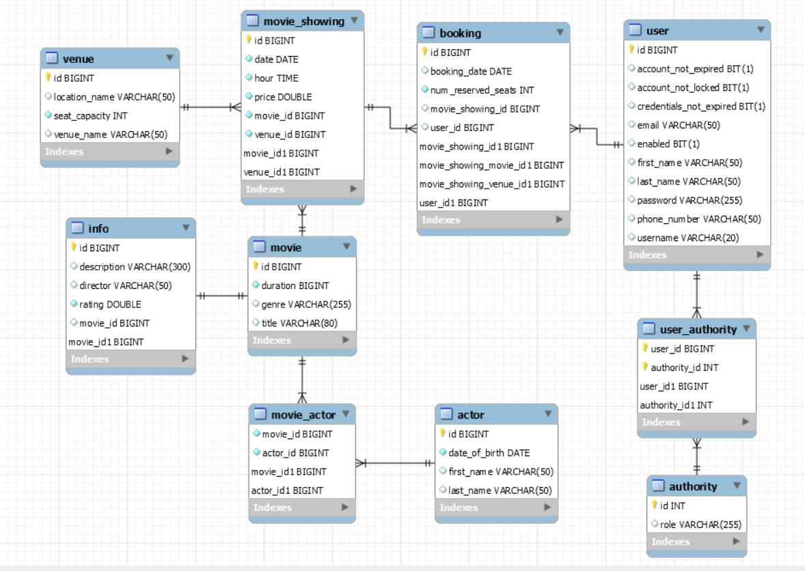

## Cinema Bookings App - Spring Boot MVC Application 

### The ERD Diagram:

### Spring Boot features:
- Authentication using Spring Security with JDBC
- 2 databases: MySql and H2
- Beans defined for services, repositories, controller, etc.
- All types of relationships: `@OneToOne`,  `@OneToMany`,  `@ManyToOne`, `@ManyToMany`
- Validation for models
- Exception handling using `@ControllerAdvice`
- CRUD operations for each entity
- Unit and integration testing using `Mockito` and `DataJpaTest`
- Logging using `Slf4j`
- Implemented paging and sorting

